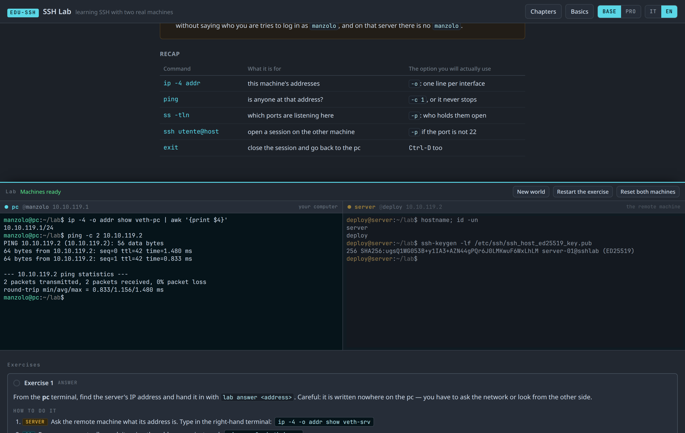
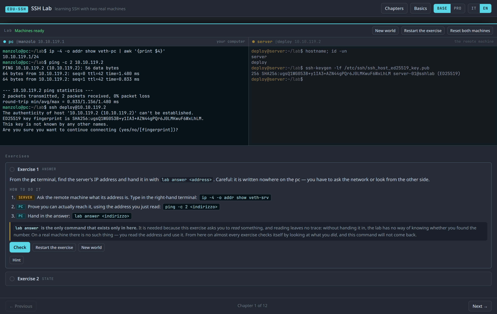
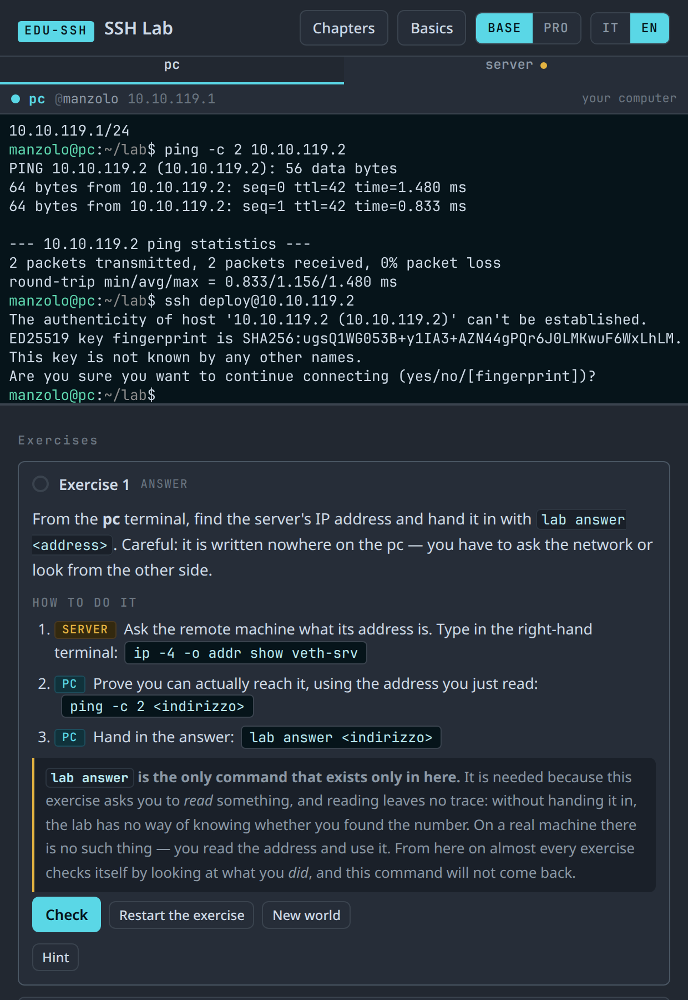

# EDU-SSH · SSH Lab

**Learning SSH with two real machines, side by side on the same page.**
Public and private keys, `ssh-agent`, SHA256 fingerprints — watching what happens on
both ends of the cable.

👉 **[Try it online](https://manzolo.github.io/SshLab/)** — nothing to install, no account.

[Versione italiana](README.md)



---

## Why two machines

Almost every SSH tutorial has you look at **one** machine. But every single thing you
need to understand is a relationship **between two**: the private key lives here and the
public one over there, the fingerprint is shown by the server and remembered by the
client, the agent answers here a challenge that was born there.

With one machine you learn the syntax. With two you learn the model.

On the left there is `manzolo@pc`, on the right `deploy@server`. They have two addresses,
two different `~/.ssh`, and a network in between. You can type in both.

## The first meeting, seen from both sides

This is the screenshot that sums up the whole course:



On the right the server states its identity with `ssh-keygen -lf`. On the left `ssh`, at
the first meeting, shows **the same fingerprint** and asks whether you trust it. It is the
same number read from two ends that had never spoken to each other: that is all there is
behind `known_hosts`, and it is far easier to grasp by seeing it than by reading about it.

## Not a simulator

It is **real OpenSSH** on **real Linux**, inside the browser tab: the kernel runs emulated
with [v86](https://github.com/copy/v86), the terminals are [xterm.js](https://xtermjs.org/).
The keys are keys, the fingerprints are the ones your own machine would give you, and an
`authorized_keys` line copied from here works outside of here too.

You can also break everything: one button puts both machines back to new in half a second.

### How they manage to be two

They are not two computers, and chapter 1 says so plainly: they are **a single kernel with
two network namespaces**, joined by a pair of virtual interfaces. The network stacks really
are two — two addresses, two routing tables, a cable in between — while the disk is shared.

That is exactly what a container is. It is also why there are two *users* (`manzolo` and
`deploy`): since the disk is the same, different HOMEs are the only way `~/.ssh` is really
a different file on the other machine.

The practical gain is large: **one emulated CPU instead of two**, one snapshot instead of
two, and a check that can look inside both hosts without opening a second channel — that
is, without depending on something the exercise itself might break.

## How an exercise is checked

Not by looking at what you typed, but at **what happened to the machines**.

For “get onto the server without a password” the check opens a real connection with
`BatchMode=yes` — which fails instead of asking for a password, turning an absence into a
measurable property — and reads `sshd`'s **log**, which knows the method and fingerprint
of what it actually accepted.

The anti-cheat comes from the world, not from surveillance: **addresses, names and keys
change with every exercise**, generated from a seed you do not know. An answer written in
a chapter cannot be copied, because in your world that number is a different one.

And when a check fails it does not say “no”: it gives you the fact it measured, the reason
in one sentence, and **a command to go look at the problem**.

## On a narrow screen

Below 1200px the two terminals stack instead of shrinking — columns matter, and a
fingerprint is 74 characters long. Below 760px they become two tabs, with a dot on the
hidden one when the other machine prints something:



## The syllabus

| | Chapter | |
|---|---|---|
| 01 | Two machines and a cable | ✅ |
| 02 | The key pair | ✅ |
| 03 | The fingerprint | ✅ |
| 04 | `authorized_keys`: getting in without a password | ✅ |
| 05 | Who signs what | ✅ |
| 06 | `known_hosts` and the first time | ✅ |
| 07 | “The fingerprint changed” | ✅ |
| 08 | Permissions: what `sshd` demands | ✅ |
| 09 | The passphrase | ✅ |
| 10 | `ssh-agent` | ✅ |
| 11 | Too many keys: `IdentitiesOnly` | ✅ |
| 12 | Rotating a key without locking yourself out | ✅ |

All twelve chapters are available in the table of contents and form one path, from
the first connection to additive key rotation.

## Running it locally

```bash
npm run image     # rootfs + snapshot (needs Docker, zstd, python zstandard) — ~4 min
npm run serve     # http://localhost:8802
```

The chapters can be read without the image: without it, only the machines are missing.

## Tests

| command | what it does |
|---|---|
| `npm test` | chapter structure, both languages, machine options kept in sync |
| `npm run test:labs` | boots the **real** machine and runs every exercise on three seeds |
| `npm run test:consegna` | the hand-in round trip **typed into the terminal**, like a person |
| `npm run test:identita` | after an `ssh`, the prompt really says `deploy@server` |
| `npm run test:tastiera` | what you type (or paste) is what reaches the machine |
| `npm run spike` | the architecture proof, with timings |
| `npm run e2e` | headless Chrome smoke test (needs `npm run serve` running) |
| `npm run screenshot` | regenerates the images in this README |

Every exercise must satisfy the five assertions of the series: the initial state does
**not** already pass · the reference solution passes **on three different seeds** · the
purpose-written cheat **fails**.

## The limits, stated

- **They are not two computers**: one kernel, two network namespaces, shared disk (see above).
- On an emulated CPU cryptography costs: an ed25519 key takes ~2 s to generate, a login
  ~8 s. An RSA-4096 would take minutes, which is why the lab never asks you to generate
  one — it asks you to **look** at one, and that is exactly why ed25519 is used today.
- On a phone everything is readable, but practising needs a real keyboard.
- `lab answer` is the only command that exists solely in here: it is needed where an
  exercise asks you to *read* something, because reading leaves no trace. Wherever it
  appears, it is declared as such.

## Relatives

Part of the **EDU-\*** series by [manzolo](https://github.com/manzolo):

- [EDU-LINUX · Linux Lab](https://github.com/manzolo/LinuxLab) — the shell, 22 chapters with a real kernel
- [EDU-CRYPTO · Cryptography Playground](https://github.com/manzolo/CryptoSimulator) — the maths under the keys: RSA, Diffie-Hellman, hashing
- [EDU-NET · Network Simulator](https://github.com/manzolo/NetworkSimulator) — what happens on the wire, packet by packet

EDU-CRYPTO explains *why* a public key works; here you see *how* it is used.

## Licence

MIT © Andrea Manzi (manzolo).
[v86](https://github.com/copy/v86) BSD-2-Clause, [xterm.js](https://xtermjs.org/) MIT —
see [THIRD-PARTY.md](THIRD-PARTY.md).
